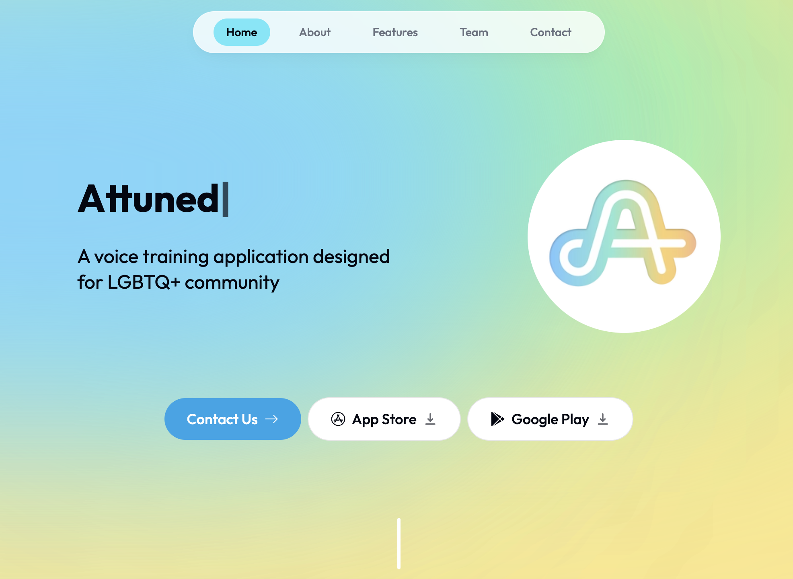

## Attuned

**This is the landing website for the [Attuned](https://attuned-gamma.vercel.app/)**

### Project Overview

A mobile application that helps LGBTQ+ users change their voice to match gender identity through voice training lessons and exercises.

### Tech Stack

| Architecture     | Tech Stack                                         |
| ---------------- | -------------------------------------------------- |
| Frontend         | React Native                                       |
| Backend          | Flask, Python                                      |
| Data Layer       | Firebase Firestore, Firebase Storage, AsyncStorage |
| Authentication   | Clerk Auth                                         |
| State Management | Context API                                        |
| Deployment       | Vercel                                             |

### App Download

Application is available for download on both IOS and Android platforms.

- [IOS](https://apps.apple.com/us/app/attuned/id1580190131)
- [Android](https://play.google.com/store/apps/details?id=com.attuned)
